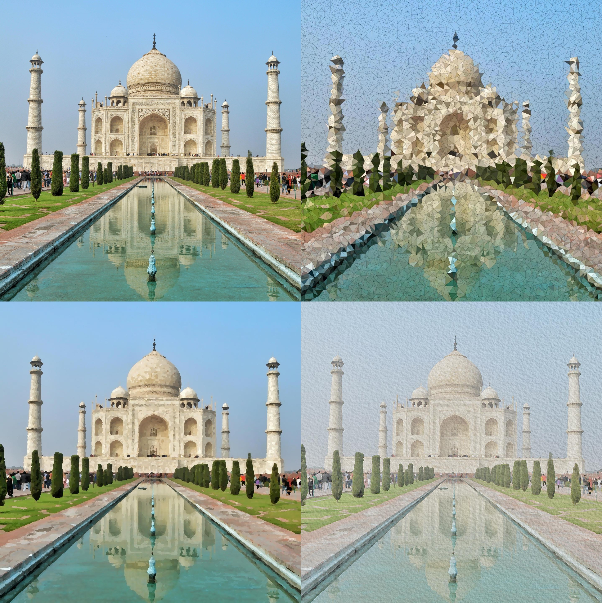
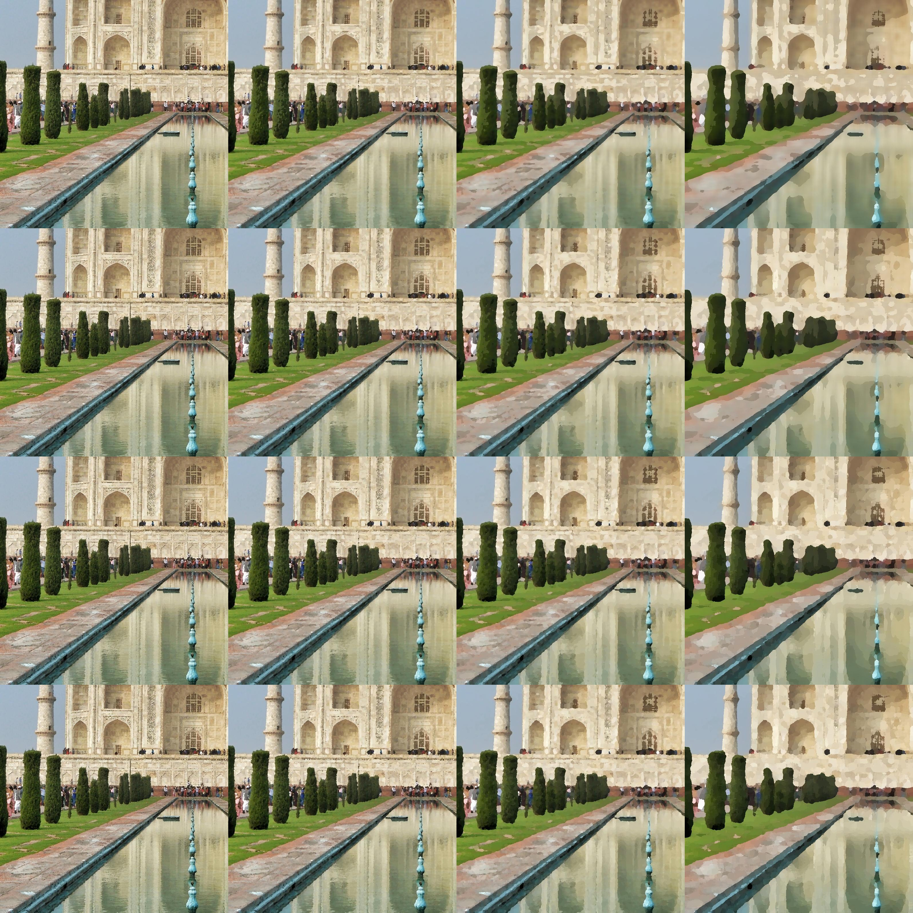
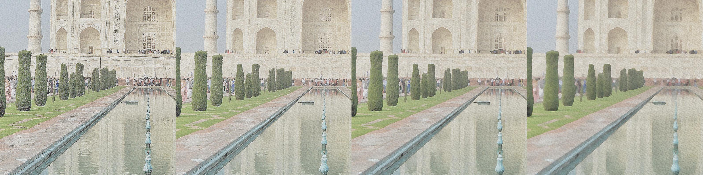

# 計算機圖形 Final Project Report

In this project I implemented three types of effect, including Oil Painting Effect, Water Color Effect, and Stained Glass Effect. These effects can be can be applied to any given image. 

## Result Demo

Top to bottom, left to right: input image, apply stained glass effect, apply oil painting effect, apply watercolor effect. (Refer to the submitted package for images with the original resolution)

## Oil Painting Effect

I implemented the algorithm described in [1]. However, the naïve implementation proved to be time-inefficient. I discovered that determining the intensity bin with the highest number of pixels for each pixel can be optimized using several convolution operations across all intensity levels. This enhancement improved the time efficiency by more than 10 folds when generating a 1440p image.

Below is a visualization showing how the two parameters, radius and number of intensity levels, affect the final result.

* Rows: Radius $1, 2, 4, 8$.

  The radius affects the sharpness of the result.

* Columns: Number of intensity levels $5, 10, 20, 40$.

  The number of intensity levels affects the local color variety, such as in the pavement in the picture, although the effect is not very obvious.

## Stained Glass

I implemented the algorithm described in [2]. The process involves uniformly and randomly sampling points within the image, then using Delaunay triangulation to connect these points. The final image is produced by drawing each triangle one by one using the Python library `matplotlib`. To enhance the result, I further refine the sampled points by removing those that are too close to each other, which helps make the output more visually appealing. Below are the resulting images for different numbers of sampled points:

## Water Color

The idea originated from [3]. I discovered that combining a median filter with a kernel for image sharpening [4] creates an image resembling watercolor art. To enhance its realism, I adjusted the gamma and blended a watercolor paper texture into the output image. The results are shown below. From left to right, the images correspond to median filter kernel sizes of $1, 2, 4, 8$. Larger median filter kernels produce progressively blurrier results.

### Reference

[1] Oil Painting Effect Algorithm: **[Oil Painting Algorithm | The Supercomputing Blog](http://supercomputingblog.com/graphics/oil-painting-algorithm/)**

[2] Stained Glass Effect Algorithm: **[Stained Glass Algorithm | The Supercomputing Blog](http://supercomputingblog.com/openmp/stained-glass-algorithm/)**

[3] Water Color Effect Algorithm: **[VR_final/Water_color.py · nickshao/VR_final · GitHub](https://github.com/nickshao/VR_final/blob/master/Water_color.py)**

[4] Kernel [**Kernel (image processing) - Wikipedia**](https://en.wikipedia.org/wiki/Kernel_(image_processing))